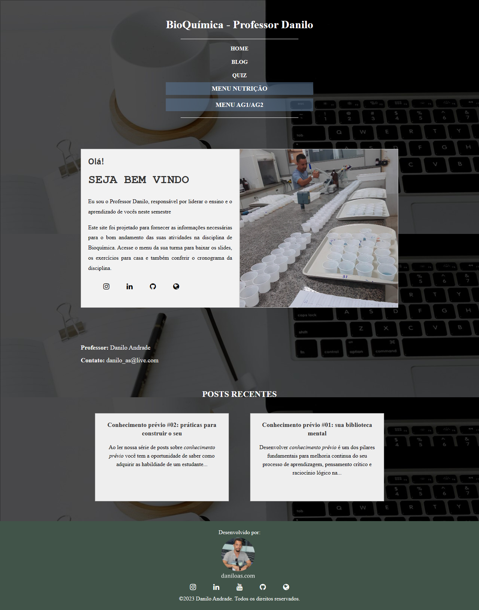

  

# Biochemistry with Danilo

Welcome to the repository of the website dedicated to the Biochemistry discipline at the Federal University of Espírito Santo. This site is a valuable tool for students and enthusiasts of biochemistry, providing educational resources, study materials, and information related to the discipline.

## About the Site

This site was developed and is maintained by Professor Danilo Andrades as an additional resource for the Biochemistry discipline. It was created using the following technologies:

- HTML
- CSS
- JavaScript
- Jekyll

## Accessing the Site

You can access the site directly at [bioquimicacomdanilo.com.br](https://bioquimicacomdanilo.com.br).

## Site Content

The site offers a variety of content related to biochemistry, including:

- Lecture slides
- Texts in our blogs
- Quizzes
- Discipline Schedule

## Contact

If you have any questions, suggestions, or want to get in touch with the professor, you can do so through the following means:

- Email: [danilo.santos@ufes.br](mailto:danilo.santos@ufes.br)
- Personal website: [daniloas.com](https://daniloas.com/)

Thank you for visiting our site, and we hope it proves helpful in your studies of biochemistry!
